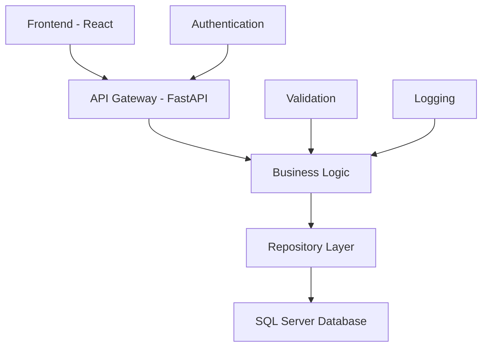

# 🎯 Sistema de Controle de Sinistros BRSAMOR

[](https://python.org)
[](https://fastapi.tiangolo.com)
[](https://reactjs.org)
[](https://microsoft.com/sql-server)

Sistema profissional para gestão completa de sinistros de transporte com interface moderna e integração com banco de dados SQL Server.

## 📋 Índice

- [Visão Geral](#-visão-geral)
- [Funcionalidades](#-funcionalidades)
- [Arquitetura](#-arquitetura)
- [Instalação](#-instalação)
- [Uso](#-uso)
- [API Documentation](#-api-documentation)
- [Estrutura do Projeto](#-estrutura-do-projeto)
- [Contribuição](#-contribuição)

## 🎯 Visão Geral

O Sistema de Controle de Sinistros BRSAMOR é uma aplicação web full-stack desenvolvida para gerenciar eficientemente sinistros de transporte, oferecendo:

- **Interface Moderna**: React com Tailwind CSS e tema dinâmico (claro/escuro)
- **Backend Robusto**: FastAPI com conexão direta ao SQL Server
- **Gestão Completa**: CRUD completo de sinistros com programação de pagamentos
- **Autenticação Segura**: Sistema de login com JWT
- **Performance Otimizada**: Queries otimizadas e paginação eficiente

## ✨ Funcionalidades

### 🔐 **Autenticação e Segurança**
- ✅ Sistema de login seguro
- ✅ Autenticação JWT
- ✅ Controle de sessões
- ✅ Proteção de rotas

### 📊 **Dashboard Profissional**
- ✅ Métricas em tempo real
- ✅ Cards informativos com cores otimizadas
- ✅ Lista de sinistros recentes
- ✅ Filtros de período (7, 30, 90, 365 dias)
- ✅ Indicadores de status

### 🗂️ **Gestão de Sinistros**
- ✅ **CRUD Completo**: Criar, visualizar, editar e atualizar sinistros
- ✅ **Busca Avançada**: Filtros por data, cliente, nota fiscal, conhecimento
- ✅ **Paginação Eficiente**: Navegação otimizada com grandes volumes de dados
- ✅ **Edição Profissional**: Formulários responsivos com validação
- ✅ **Programação de Pagamentos**: Sistema completo de programação de indenizações

### 💰 **Programação de Pagamentos (NEW)**
- ✅ **Múltiplas Programações**: Suporte a várias parcelas de pagamento
- ✅ **Campos Dinâmicos**: Data, valor e documento ESL
- ✅ **Persistência Automática**: Salvamento na tabela `ProgramacaoPagamento`
- ✅ **Carregamento Inteligente**: Dados preenchidos automaticamente na edição
- ✅ **Timestamps Automáticos**: Data de criação e atualização controladas

### 🎨 **Interface e UX**
- ✅ **Design Responsivo**: Compatível com desktop, tablet e mobile
- ✅ **Tema Dinâmico**: Modo claro e escuro com transições suaves
- ✅ **Componentes Modernos**: UI consistente e profissional
- ✅ **Feedback Visual**: Loading states e mensagens de erro/sucesso

## 🏗️ Arquitetura



### **Stack Tecnológico**

#### 🎨 **Frontend**
- **React 18.2.0**: Framework principal com Hooks
- **Vite 4.x**: Build tool otimizado
- **Tailwind CSS 3.x**: Framework CSS utilitário
- **React Router 6.x**: Roteamento SPA
- **Axios**: Cliente HTTP para APIs

#### ⚡ **Backend**
- **FastAPI 0.111.0**: Framework web assíncrono
- **Python 3.12**: Linguagem principal
- **Pydantic**: Validação e serialização de dados
- **PyODBC**: Connector para SQL Server
- **Uvicorn**: Servidor ASGI de produção

#### 🗄️ **Banco de Dados**
- **SQL Server 2019+**: Banco principal
- **PyODBC**: Driver de conexão
- **Stored Procedures**: Otimização de queries complexas

## 🚀 Instalação

### **Pré-requisitos**
- Python 3.12+
- Node.js 18+
- SQL Server com acesso às tabelas do sistema
- Git

### **1. Clone o Repositório**
```bash
git clone https://github.com/seu-usuario/sinistros-control.git
cd sinistros-control
```

### **2. Configuração do Backend**
```bash
cd backend

# Criar ambiente virtual
python -m venv venv

# Ativar ambiente virtual
# Windows:
venv\Scripts\activate
# Linux/Mac:
source venv/bin/activate

# Instalar dependências
pip install -r requirements.txt

# Configurar variáveis de ambiente
cp .env.example .env
# Editar .env com suas configurações de banco
```

### **3. Configuração do Frontend**
```bash
cd frontend

# Instalar dependências
npm install

# Configurar ambiente
cp .env.example .env.local
# Editar .env.local com a URL da API
```

### **4. Configuração do Banco de Dados**
Certifique-se de que as seguintes tabelas existem:
- `SinistrosControle`: Dados principais dos sinistros
- `ProgramacaoPagamento`: Programação de pagamentos/indenizações

## 🎯 Uso

### **Desenvolvimento (Recomendado)**
```bash
# Iniciar backend (Terminal 1)
cd backend
python run.py

# Iniciar frontend (Terminal 2)
cd frontend
npm run dev
```

### **Scripts Automatizados**
```bash
# Windows - Iniciar sistema completo
start_backend_simple.bat
start_frontend_simple.bat

# Ou usar o script unificado (se disponível)
start_complete_system.bat
```

### **Acessos**
- **🌐 Aplicação**: http://localhost:5173
- **📚 API Docs**: http://localhost:8000/docs
- **📖 ReDoc**: http://localhost:8000/redoc

## 📚 API Documentation

### **Endpoints Principais**

#### **Autenticação**
```
POST /api/auth/login     # Login de usuário
POST /api/auth/register  # Registro de usuário
```

#### **Sinistros**
```
GET    /api/automacao/sinistros              # Listar sinistros
GET    /api/automacao/sinistros/{id}         # Obter sinistro específico
PUT    /api/automacao/sinistros/{id}         # Atualizar sinistro
POST   /api/automacao/sinistros              # Criar sinistro
DELETE /api/automacao/sinistros/{id}         # Deletar sinistro
```

#### **Dashboard**
```
GET /api/automacao/dashboard/stats/{periodo} # Métricas do dashboard
GET /api/automacao/dashboard/recentes        # Sinistros recentes
```

### **Exemplo de Uso da API**

#### **Obter Sinistro com Programação de Pagamento**
```http
GET /api/automacao/sinistros/15922
Authorization: Bearer {token}

Response:
{
  "success": true,
  "data": {
    "id": 11,
    "nota_fiscal": "15922",
    "conhecimento": "123456",
    "programacao_pagamento": [
      {
        "data": "2025-02-01",
        "valor": "20000.0",
        "doctoESL": "85651"
      },
      {
        "data": "2025-03-01", 
        "valor": "16161.0",
        "doctoESL": "1615"
      }
    ]
  }
}
```

#### **Atualizar Sinistro com Programação**
```http
PUT /api/automacao/sinistros/11
Content-Type: application/json
Authorization: Bearer {token}

{
  "nota_fiscal": "15922",
  "conhecimento": "123456",
  "programacao_pagamento": [
    {
      "data": "2025-02-01",
      "valor": "25000.00",
      "doctoESL": "85651"
    }
  ]
}
```

## 📁 Estrutura do Projeto

```
sinistros-control/
├── 📁 backend/                 # Backend FastAPI
│   ├── 📁 app/
│   │   ├── 📁 core/           # Configurações e utilitários
│   │   ├── 📁 models/         # Modelos SQLAlchemy
│   │   ├── 📁 repositories/   # Camada de dados
│   │   ├── 📁 routers/        # Endpoints da API
│   │   ├── 📁 schemas/        # Schemas Pydantic
│   │   ├── 📁 services/       # Lógica de negócio
│   │   └── 📄 main.py         # Aplicação principal
│   ├── 📄 requirements.txt    # Dependências Python
│   └── 📄 run.py             # Script de inicialização
│
├── 📁 frontend/               # Frontend React
│   ├── 📁 src/
│   │   ├── 📁 components/     # Componentes reutilizáveis
│   │   ├── 📁 contexts/       # Context API
│   │   ├── 📁 pages/          # Páginas da aplicação
│   │   ├── 📁 services/       # Serviços de API
│   │   ├── 📁 utils/          # Utilitários
│   │   └── 📄 main.jsx        # Entrada da aplicação
│   ├── 📄 package.json        # Dependências Node.js
│   └── 📄 vite.config.js      # Configuração Vite
│
├── 📁 shell/                  # Scripts de automação
├── 📄 README.md              # Documentação
└── 📄 .gitignore            # Arquivos ignorados
```

## 🔧 Configuração Avançada

### **Variáveis de Ambiente**

#### **Backend (.env)**
```env
# Banco de Dados
DB_SERVER=seu-servidor
DB_DATABASE=sua-database
DB_USERNAME=usuario
DB_PASSWORD=senha

# Segurança
SECRET_KEY=sua-chave-secreta
ALGORITHM=HS256
ACCESS_TOKEN_EXPIRE_MINUTES=30

# Ambiente
ENVIRONMENT=development
DEBUG=true
```

#### **Frontend (.env.local)**
```env
VITE_API_BASE_URL=http://localhost:8000
VITE_APP_TITLE=Sistema de Sinistros BRSAMOR
VITE_ENVIRONMENT=development
```

## 🚀 Deploy

### **Produção**
```bash
# Backend
cd backend
pip install gunicorn
gunicorn app.main:app --workers 4 --worker-class uvicorn.workers.UvicornWorker --bind 0.0.0.0:8000

# Frontend
cd frontend
npm run build
# Servir pasta dist/ com nginx ou similar
```


## 🔍 Solução de Problemas

### **Erros Comuns**

#### **1. Erro de Conexão com Banco**
```
Verifique:
- Credenciais do banco de dados
- Driver PyODBC instalado
- Conectividade de rede
- Permissões de usuário
```

#### **2. Erro de CORS**
```
Configure no backend:
app.add_middleware(CORSMiddleware, allow_origins=["*"])
```

#### **3. Dados de Programação Não Carregam**
```
Verifique:
- Tabela ProgramacaoPagamento existe
- sinistro_id correto na relação
- Método _buscar_programacao_pagamento funcionando
```

## 📈 Monitoramento

### **Logs do Sistema**
```python
# Backend - configurado com logger
import logging
logger = logging.getLogger(__name__)

# Visualizar logs
tail -f backend/logs/app.log
```

### **Métricas de Performance**
- Tempo de resposta da API
- Conexões simultâneas ao banco
- Memory usage do frontend
- Erros HTTP por endpoint

## 🤝 Contribuição

1. **Fork** o projeto
2. **Crie** uma branch para sua feature (`git checkout -b feature/AmazingFeature`)
3. **Commit** suas mudanças (`git commit -m 'Add some AmazingFeature'`)
4. **Push** para a branch (`git push origin feature/AmazingFeature`)
5. **Abra** um Pull Request

### **Padrões de Código**
- **Python**: PEP 8, Black formatter
- **JavaScript**: ESLint + Prettier
- **CSS**: Tailwind CSS classes
- **Commits**: Conventional Commits

## 📄 Licença

Este projeto é licenciado sob a licença MIT - veja o arquivo [LICENSE](LICENSE) para detalhes.

## 👥 Equipe

- **Desenvolvimento**: Equipe BRSAMOR
- **Arquitetura**: Sistema baseado em Clean Architecture
- **UI/UX**: Design responsivo e moderno

## 📞 Suporte

Para suporte técnico:
- 📧 Email: suporte@brsamor.com.br
- 📱 Telefone: (11) 1234-5678
- 🐛 Issues: [GitHub Issues](https://github.com/seu-usuario/sinistros-control/issues)

---

<div align="center">

**🎯 Sistema de Controle de Sinistros BRSAMOR**

*Desenvolvido com ❤️ para gestão profissional de sinistros de transporte*

[](https://github.com/seu-usuario/sinistros-control)
[](https://choosealicense.com/licenses/mit/)

</div>
